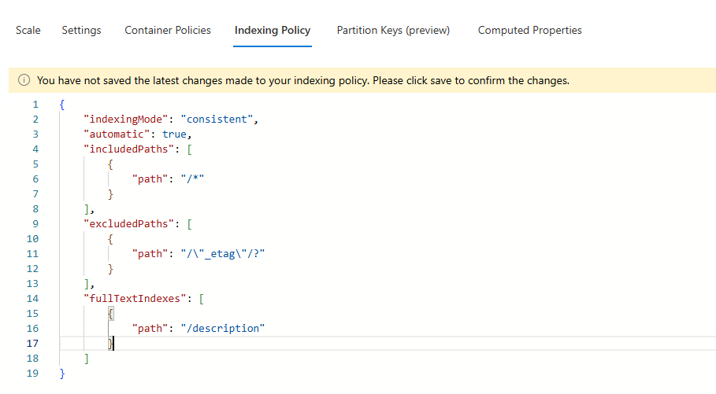

# Crime Data Setup Guide

This guide explains how to populate the Cosmos DB crime database with sample data and configure full-text search capabilities after the workload infrastructure deployment.

## Overview

The crime tracking system uses Azure Cosmos DB with advanced features:
- **Full-Text Search** for natural language queries
- **Full-Text Indexing** for optimized text-based searches

## Prerequisites

✅ Completed deployment stage: `create-workload-infra.yml`
- Cosmos DB account created: `cosmos-elder-{resourceToken}`
- Database created: `skyrim`
- Container created: `crime` with partition key `/crimeType`

## Crime Data Schema

Each crime record in `dataset/crimes.json` contains:

```json
{
    "crimeName": "Theft of Sweetrolls from Guards",
    "city": "Whiterun",
    "suspectName": "Bjorn Iron-Fist",
    "reward": 1500,
    "description": "Nord male warrior with iron armor and a battle-worn face",
    "crimeType": "pettyTheft"
}
```

**Crime Types** (Partition Key):
- `pettyTheft` - Minor theft offenses
- `grandTheft` - Major theft of valuable items
- `arson` - Fire-related crimes
- `robbery` - Armed theft with confrontation
- `poisoning` - Use of poison or toxins
- `heresy` - Religious or cult-related offenses
- `propertyDamage` - Destruction of property
- `minorOffense` - Other minor crimes

## Step 1: Upload Crime Data to Cosmos DB

### Using Azure Portal

1. **Navigate to Cosmos DB**:
   - Open Azure Portal
   - Go to Resource Group: `rg-skyrim-world`
   - Select Cosmos DB account: `cosmos-elder-{resourceToken}`

2. **Open Data Explorer**:
   - Click **Data Explorer** in the left menu
   - Expand database: `skyrim`
   - Expand container: `crime`

3. **Upload JSON Data**:
   - Click **Upload Item** button in the toolbar
   - Browse and select: `dataset/crimes.json`
   - Click **Upload**
   - Wait for confirmation (466 items)

4. **Verify Upload**:
   - Click **Items** under the `crime` container
   - You should see all crime records listed
   - Verify various `crimeType` partitions are populated

## Step 2: Configure Full-Text Search

The container is pre-configured with full-text search capabilities via the Bicep deployment. Here's what was automatically configured:

### Full-Text Search Policy

```bicep
fullTextPolicy: {
  defaultLanguage: 'en-US'
  fullTextPaths: [
    {
      language: 'en-US'
      path: '/crimeName'
    }
    {
      language: 'en-US'
      path: '/description'
    }
  ]
}
```

**Purpose**: Enables natural language search on crime names and descriptions.

### Full-Text Indexing Policy

```bicep
indexingPolicy: {
  fullTextIndexes: [
    {
      path: '/description'
    }
    {
      path: '/crimeName'
    }
  ]
}
```

**Purpose**: Creates optimized indexes for fast text-based queries.

## Step 3: Verify Full-Text Search Configuration

### Using Azure Portal

1. **Open Container Settings**:
   - Navigate to Data Explorer
   - Right-click on `crime` container
   - Select **Settings**

2. **Check Indexing Policy**:
   - Scroll to **Indexing Policy** section
   - Verify full-text indexes are present:

   

3. **Check Full-Text Policy**:
   - Look for **Full-Text Search** configuration
   - Verify paths for `crimeName` and `description`

   

4. **Review Complete Indexing**:
   - Verify all indexing policies are active
   
   

## Step 4: Test Full-Text Search Queries

### Example Queries

**Query 1: Search by crime name**
```sql
SELECT * FROM c 
WHERE CONTAINS(c.crimeName, "theft", true)
```

**Query 2: Search by description**
```sql
SELECT * FROM c 
WHERE CONTAINS(c.description, "mage", true)
```

**Query 3: Search by city and crime type**
```sql
SELECT * FROM c 
WHERE c.city = "Whiterun" 
AND c.crimeType = "pettyTheft"
```

**Query 4: Full-text search across multiple fields**
```sql
SELECT * FROM c 
WHERE CONTAINS(c.crimeName, "dragon", true) 
   OR CONTAINS(c.description, "dragon", true)
```

**Query 5: High-reward crimes**
```sql
SELECT c.crimeName, c.suspectName, c.reward 
FROM c 
WHERE c.reward > 1500
ORDER BY c.reward DESC
```

### Testing in Azure Portal

1. Open **Data Explorer**
2. Select the `crime` container
3. Click **New SQL Query**
4. Paste one of the example queries
5. Click **Execute Query**
6. Review results

## Data Statistics

The `crimes.json` dataset contains:
- **Total Records**: 466 crime entries
- **Cities**: Whiterun, Winterhold, Solitude, Riften, Markarth, Windhelm, Falkreath, Dawnstar, Riverwood, and more
- **Crime Types**: 8 distinct categories
- **Reward Range**: 400 - 2,000 gold pieces

## Troubleshooting

### Issue: Upload Failed

**Solution**: 
- Check Cosmos DB connection string
- Verify you have appropriate permissions (Cosmos DB Data Contributor)
- Ensure JSON file is valid format

### Issue: Full-Text Search Not Working

**Solution**:
- Wait for indexing to complete (can take a few minutes)
- Verify indexing policy is active in container settings
- Check that full-text paths match your document structure

### Issue: Query Returns No Results

**Solution**:
- Verify data was uploaded successfully
- Check partition key value in query
- Ensure case-sensitivity in search terms
- Review indexing progress in Metrics blade

## Next Steps

After uploading crime data:

1. ✅ Deploy Crime Function: Run `deploy-crime-function.yml` workflow
2. ✅ Deploy Mage Guild API: Run `deploy-mage-guild-api.yml` workflow
3. 🔄 Test API endpoints with crime data
4. 🔄 Configure AI agents to query crime database

## Additional Resources

- [Azure Cosmos DB Full-Text Search Documentation](https://learn.microsoft.com/azure/cosmos-db/nosql/query/full-text)
- [Cosmos DB Data Explorer Guide](https://learn.microsoft.com/azure/cosmos-db/data-explorer)

---

**Last Updated**: January 2026  
**Data Version**: 1.0  
**Total Crime Records**: 466