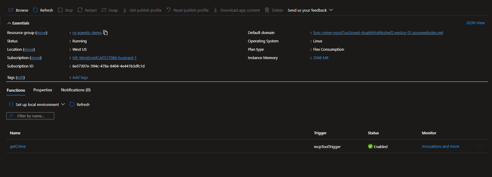
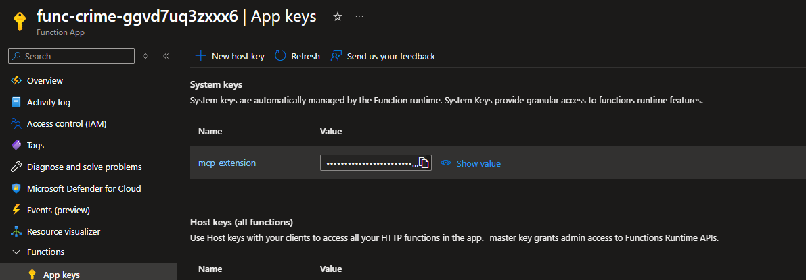
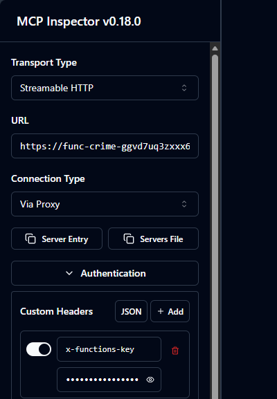
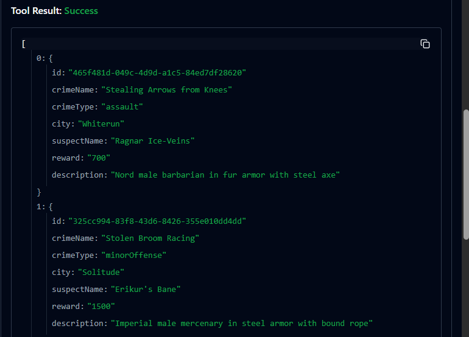

# MCP Server Deployment Guide

This guide explains how to deploy the Skyrim Crime MCP (Model Context Protocol) Server to Azure Functions and test it using the MCP Inspector.

## Overview

The Skyrim Crime MCP Server is an Azure Function-based MCP server that provides AI agents with tools to query crime data from Cosmos DB. It exposes a `getCrime` tool that supports filtering by crime type, crime name, city, and description using full-text search capabilities.

## Architecture

- **Runtime**: .NET 8.0 Isolated Worker
- **Hosting**: Azure Functions Flex Consumption Plan
- **Dependencies**: 
  - Azure Cosmos DB (crime database)
  - Azure Storage Account (deployment packages)
  - Application Insights (telemetry and monitoring)

## Prerequisites

✅ **Completed Steps**:
1. Infrastructure deployed via `create-workload-infra.yml`
2. Crime data uploaded to Cosmos DB (see [CRIME.MD](CRIME.MD))
3. GitHub secrets configured:
   - `AZURE_CREDENTIALS` - Service principal credentials
   - `FUNCTION_CRIMERE_SOURCENAME` - Function App name (auto-configured)

## MCP Server Components

### Function: getCrime

**Tool Name**: `getCrime`  
**Description**: Get list of crimes in Skyrim  
**Parameters**:
- `crimeType` (optional) - The type of crime (pettyTheft, grandTheft, arson, etc.)
- `crimeName` (optional) - The crime name (uses full-text search)
- `city` (optional) - The city where the crime was committed
- `description` (optional) - Description text to search (uses full-text search)

**Query Behavior**:
- Uses `FullTextContains` for `crimeName` and `description` fields
- Supports exact matching for `crimeType` and `city`
- Returns all matching crime records from Cosmos DB
- At least one parameter must be provided

## Deployment Process

### Step 1: Deploy via GitHub Actions

1. **Navigate to GitHub Actions**:
   - Go to your repository on GitHub
   - Click **Actions** tab
   - Select **Deploy MCP Skyrim Crime Server** workflow

2. **Run the Workflow**:
   - Click **Run workflow** button
   - Select the branch (usually `main`)
   - Click **Run workflow**

3. **Monitor Deployment**:
   - Watch the workflow progress
   - Check for successful completion of:
     - ✅ Checkout code
     - ✅ Setup .NET 8.0
     - ✅ Build and compile function
     - ✅ Azure login
     - ✅ Deploy to Azure Functions

4. **Verify Deployment**:
   - Check workflow logs for deployment confirmation
   - Note the Function App URL (format: `https://<function-name>.azurewebsites.net`)

### Step 2: Verify in Azure Portal

1. **Navigate to Function App**:
   - Open Azure Portal
   - Go to Resource Group: `rg-skyrim-world`
   - Find Function App: `func-crime-<resourceToken>`

   

2. **Check Function Status**:
   - Click **Functions** in left menu
   - Verify `getCrime` function appears
   - Status should be **Enabled**

   

3. **Review Configuration**:
   - Click **Configuration** under Settings
   - Verify environment variables:
     - `CosmosDBConnectionString` - Connection to Cosmos DB
     - `AzureWebJobsStorage` - Storage account connection
     - `APPLICATIONINSIGHTS_CONNECTION_STRING` - App Insights

   

4. **Check Logs**:
   - Click **Log stream** to see real-time logs
   - Verify no startup errors

   

## Testing with MCP Inspector

The MCP Inspector is a developer tool for testing MCP servers locally before integrating them with AI agents.

### Step 1: Install MCP Inspector

```bash
npm install -g @modelcontextprotocol/inspector
```

Or use npx (no installation required):
```bash
npx @modelcontextprotocol/inspector
```

### Step 2: Get Function URL

1. In Azure Portal, navigate to your Function App
2. Click **Functions** → **getCrime**
3. Click **Get Function Url** button
4. Copy the URL with the function key:
   ```
   https://func-crime-<token>.azurewebsites.net/api/mcp?code=<your-function-key>
   ```

   

### Step 3: Launch MCP Inspector

Run the inspector with your function URL:

```bash
npx @modelcontextprotocol/inspector
```

The inspector will open in your browser at `http://localhost:5173`

### Step 4: Connect to MCP Server

1. **In the MCP Inspector UI**:
   - Click **Add Server** or **Connect**
   - Select **HTTP/SSE** transport type
   - Enter your Function URL

2. **Connection Settings**:
   ```json
   {
     "url": "https://func-crime-<token>.azurewebsites.net/api/mcp?code=<key>",
     "transport": "http"
   }
   ```

3. **Click Connect**

### Step 5: Test the getCrime Tool

Once connected, you should see the `getCrime` tool listed.

#### Test Case 1: Search by City
```json
{
  "city": "Whiterun"
}
```
**Expected Result**: Returns all crimes committed in Whiterun

#### Test Case 2: Search by Crime Type
```json
{
  "crimeType": "pettyTheft"
}
```
**Expected Result**: Returns all petty theft crimes

#### Test Case 3: Full-Text Search in Crime Name
```json
{
  "crimeName": "murder"
}
```
**Expected Result**: Returns crimes with "murder" in the name (using full-text search)

#### Test Case 4: Full-Text Search in Description
```json
{
  "description": "dragon"
}
```
**Expected Result**: Returns crimes mentioning "dragon" in descriptions

#### Test Case 5: Combined Filters
```json
{
  "city": "Whiterun",
  "crimeType": "pettyTheft",
  "description": "gold"
}
```
**Expected Result**: Returns petty theft crimes in Whiterun with "gold" in description

#### Test Case 6: Multiple Keywords Search
```json
{
  "description": "armor warrior"
}
```
**Expected Result**: Returns crimes with "armor" AND "warrior" in description

### Step 6: Validate Results

In the MCP Inspector, check:
- ✅ **Response Time**: Should be under 2 seconds
- ✅ **Status**: Success (200 OK)
- ✅ **Data Structure**: Array of crime objects
- ✅ **Fields Returned**: crimeName, city, suspectName, reward, description, crimeType
- ✅ **Full-Text Search**: Verify stemming works (e.g., "theft" matches "thefts")

**Example Response**:
```json
[
  {
    "crimeName": "Theft of Sweetrolls from Guards",
    "city": "Whiterun",
    "suspectName": "Bjorn Iron-Fist",
    "reward": 1500,
    "description": "Nord male warrior with iron armor and a battle-worn face",
    "crimeType": "pettyTheft"
  }
]
```

## Troubleshooting

### Issue: Function Deployment Failed

**Symptoms**: GitHub Actions workflow fails at "Run Azure Functions Action" step

**Solutions**:
- Verify `AZURE_CREDENTIALS` secret is correctly configured
- Check that Function App exists in Azure
- Verify `FUNCTION_CRIMERE_SOURCENAME` secret matches actual Function App name
- Review deployment logs in GitHub Actions

### Issue: Function Returns 500 Error

**Symptoms**: MCP Inspector shows internal server error

**Solutions**:
1. Check Application Insights for detailed errors:
   - Go to Function App → Application Insights
   - View **Failures** blade
   - Check exception details

2. Verify Cosmos DB connection:
   - Test `CosmosDBConnectionString` in Configuration
   - Ensure Cosmos DB account is accessible
   - Check firewall rules allow Function App

3. Review Function logs:
   - Open **Log stream** in Azure Portal
   - Look for connection errors or exceptions

### Issue: "No parameters was passed" Error

**Symptoms**: Error message when calling getCrime with empty parameters

**Solution**: 
- Provide at least one parameter (crimeType, crimeName, city, or description)
- Example: `{"city": "Whiterun"}`

### Issue: MCP Inspector Cannot Connect

**Symptoms**: Connection timeout or refused

**Solutions**:
- Verify Function URL includes the function key (`?code=...`)
- Check Function App is running (not stopped)
- Ensure function key is valid (regenerate if needed)
- Try accessing the URL directly in browser to verify endpoint is accessible

### Issue: Empty Results Returned

**Symptoms**: Query succeeds but returns empty array

**Solutions**:
- Verify crime data was uploaded (see [CRIME.MD](CRIME.MD))
- Check parameter values match data (case-sensitive for city/crimeType)
- Use Azure Data Explorer to test queries directly
- Verify full-text indexing is complete

### Issue: Slow Performance

**Symptoms**: Queries take more than 5 seconds

**Solutions**:
- Check Cosmos DB RU consumption in Azure Portal
- Verify full-text indexes are configured correctly
- Consider increasing Cosmos DB provisioned throughput
- Review Function App scaling settings

## Monitoring and Diagnostics

### Application Insights

View telemetry and diagnostics:

1. **Navigate to Application Insights**:
   - Resource Group → Application Insights resource
   - Or Function App → Application Insights

2. **Key Metrics to Monitor**:
   - **Requests**: Function invocation count and success rate
   - **Performance**: Response times and dependencies
   - **Failures**: Exception rates and error details
   - **Availability**: Function health checks

3. **Custom Queries** (Logs blade):

```kusto
// Recent function invocations
requests
| where timestamp > ago(1h)
| where name == "getCrime"
| project timestamp, duration, resultCode, customDimensions
| order by timestamp desc

// Error analysis
exceptions
| where timestamp > ago(24h)
| where operation_Name == "getCrime"
| project timestamp, type, outerMessage, innermostMessage
| order by timestamp desc

// Performance trends
requests
| where name == "getCrime"
| summarize avg(duration), percentile(duration, 95), count() by bin(timestamp, 5m)
| render timechart
```

### Cost Monitoring

Monitor Function App costs:
- Go to **Cost Analysis** in subscription or resource group
- Filter by Function App resource
- Track consumption patterns
- Flex Consumption plan charges based on execution time and memory

## Integration with AI Agents

Once the MCP server is deployed and tested, you can integrate it with AI agents:

### Configuration Example (for Claude Desktop or similar)

```json
{
  "mcpServers": {
    "skyrim-crime": {
      "url": "https://func-crime-<token>.azurewebsites.net/api/mcp?code=<key>",
      "transport": "http"
    }
  }
}
```

### Example Agent Queries

Agents can now use natural language to query crimes:

- "Find all theft crimes in Whiterun"
- "Show me crimes involving dragons"
- "List high-reward crimes over 1500 gold"
- "Get all robbery cases in Riften"

## GitHub Actions Workflow Details

### Workflow File: `.github/workflows/deploy-crime-function.yml`

**Trigger**: Manual (`workflow_dispatch`)

**Steps**:
1. Checkout repository code
2. Setup .NET 8.0 SDK
3. Build and compile .NET project
4. Authenticate with Azure using service principal
5. Deploy compiled output to Azure Functions

**Environment Variables**:
- `AZURE_FUNCTIONAPP_NAME`: Retrieved from `FUNCTION_CRIMERE_SOURCENAME` secret
- `AZURE_FUNCTIONAPP_PACKAGE_PATH`: `./src/MCP/crimeMCPServer/Crime`
- `DOTNET_VERSION`: `8.0.x`

### Known Issues in Workflow

⚠️ **Secret Name Typo**: The workflow uses `FUNCTION_CRIMERE_SOURCENAME` which appears to have a typo (extra 'RE'). Verify the actual secret name in your repository settings matches the workflow.

## Security Considerations

- **Function Keys**: Keep function keys secure; they provide access to your MCP server
- **Cosmos DB Connection**: Connection string is stored in Function App configuration (encrypted)
- **CORS**: Currently allows Azure Portal; update for production use
- **Network Security**: Consider using Private Endpoints for enhanced security
- **Managed Identity**: Future enhancement to eliminate connection strings

## Next Steps

After successful MCP server deployment:

1. ✅ Deploy Mage Guild API: Run `deploy-mage-guild-api.yml`
2. 🔄 Configure AI agents to use the MCP server
3. 🔄 Set up additional MCP tools as needed
4. 🔄 Implement monitoring alerts and dashboards

## Additional Resources

- [Model Context Protocol Documentation](https://modelcontextprotocol.io/)
- [MCP Inspector GitHub](https://github.com/modelcontextprotocol/inspector)
- [Azure Functions Documentation](https://learn.microsoft.com/azure/azure-functions/)
- [Azure Functions MCP Extension](https://learn.microsoft.com/azure/azure-functions/functions-bindings-mcp)

---

**Last Updated**: January 2026  
**MCP Server Version**: 1.0.0  
**Function Runtime**: .NET 8.0 Isolated
